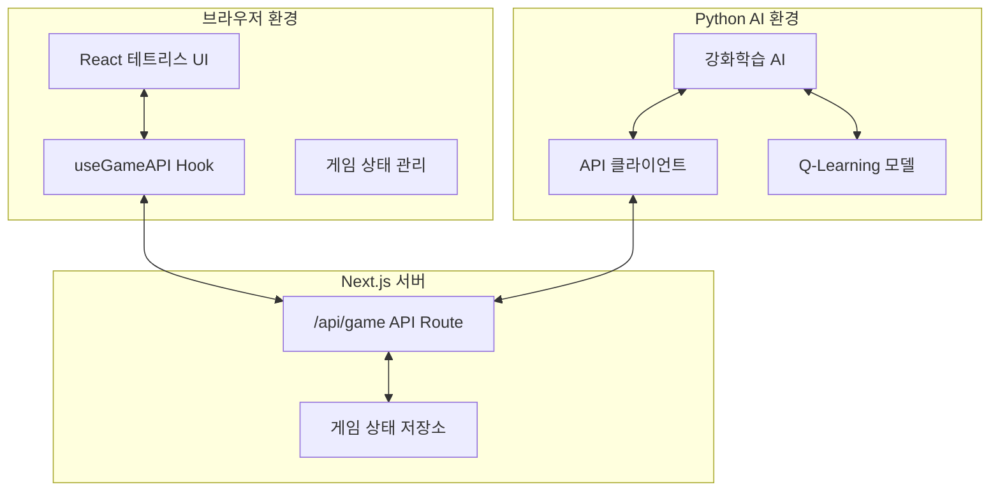

# 시스템 패턴 (System Patterns)

## 🏗️ 전체 아키텍처

### 시스템 구성 요소


### 데이터 흐름
1. **사용자 입력** → React 컴포넌트 → 게임 상태 업데이트
2. **게임 상태** → useGameAPI → API 전송
3. **Python AI** → API 호출 → 게임 상태 수신
4. **AI 판단** → 액션 결정 → API로 액션 전송
5. **API** → 액션 큐에 저장 → React에서 액션 실행

## 🔄 핵심 디자인 패턴

### 1. API-First 통신 패턴
**목적**: 웹과 Python 간 느슨한 결합
```typescript
// API 인터페이스 표준화
interface GameAPI {
  type: 'update' | 'getActions' | 'action'
  state?: GameState
  action?: string
  actions?: string[]
}
```

**장점**:
- 언어 독립적 통신
- 확장 가능한 구조
- 디버깅 용이성

### 2. React Hooks 패턴
**파일**: `hooks/useGameAPI.ts`
```typescript
// 게임 API 로직 캡슐화
export function useGameAPI(gameState: GameState, onAction: (action: string) => void) {
  // 상태 동기화 + 액션 폴링
}
```

**특징**:
- 비즈니스 로직 분리
- 재사용 가능한 훅
- 자동 상태 동기화

### 3. 상태 머신 패턴 (게임 로직)
```typescript
type GameState = {
  board: (number | null)[][]
  currentPiece: Piece | null
  nextPiece: Piece | null
  score: number
  level: number
  lines: number
  isGameOver: boolean
  isPaused: boolean
}
```

**상태 전이**:
- `Playing` → `Paused` → `Playing`
- `Playing` → `GameOver` → `Reset` → `Playing`

### 4. Observer 패턴 (AI 모니터링)
```python
# AI가 게임 상태 변화를 감지하고 반응
class ReinforcementTetrisAI:
    def train(self):
        # 상태 관찰 → 액션 선택 → 보상 계산 → 학습
```

## 🔧 기술 구현 패턴

### 1. 폴링 기반 실시간 통신
**클라이언트 사이드**:
```typescript
useEffect(() => {
  const interval = setInterval(fetchAndExecuteActions, 200);
  return () => clearInterval(interval);
}, [fetchAndExecuteActions]);
```

**Python 사이드**:
```python
def train(self, episodes=100, max_steps=1000):
    for episode in range(episodes):
        while not done:
            state = self.client.get_game_state()
            action = self.agent.get_action(state)
            self.client.send_action(action)
```

### 2. 에러 복구 패턴
```typescript
// API 호출 실패 시 자동 재시도
try {
  await fetch('/api/game', { ... });
} catch (error) {
  console.error('Failed to update game state:', error);
  // 계속 진행 (게임 중단 방지)
}
```

### 3. 모델 영속성 패턴
```python
# 학습 모델 자동 저장/로드
def save_model(self, filepath):
    with open(filepath, 'w') as f:
        json.dump(model_data, f, indent=2)

def load_model(self, filepath):
    if os.path.exists(filepath):
        # 기존 모델 로드
    else:
        # 새 모델 초기화
```

## 📊 데이터 모델링

### 게임 상태 직렬화
```json
{
  "board": [[null, null, ...], [1, 2, ...]],
  "currentPiece": {
    "type": "T",
    "position": {"x": 4, "y": 0},
    "rotation": 0
  },
  "score": 1500,
  "level": 3,
  "lines": 15,
  "isGameOver": false,
  "isPaused": false
}
```

### AI 액션 명령어
```typescript
type TetrisAction = 'left' | 'right' | 'down' | 'rotate' | 'drop'
```

### API 응답 형식
```json
{
  "success": true,
  "data": { "게임 상태" },
  "actions": ["left", "rotate", "drop"],
  "error": null
}
```

## 🔍 핵심 알고리즘

### 1. 테트리스 게임 로직
- **충돌 감지**: 블록과 보드/다른 블록 간 충돌
- **라인 클리어**: 가득 찬 행 감지 및 제거
- **블록 생성**: 7-bag 시스템으로 공정한 블록 분배

### 2. Q-Learning 구현
```python
# 상태 → 액션 → 보상 → 학습
def replay(self, batch_size=32):
    for state, action, reward, next_state, done in batch:
        target = reward + self.discount_factor * max(Q[next_state])
        Q[state][action] += learning_rate * (target - Q[state][action])
```

### 3. 게임 상태 특징 추출
```python
def state_to_key(self, state):
    # 보드 → 높이, 구멍, 완성 라인 등으로 변환
    heights = [self.get_column_height(col) for col in range(10)]
    holes = self.count_holes(board)
    lines = self.count_complete_lines(board)
    return f"h:{heights}|holes:{holes}|lines:{lines}"
```

## 🔒 보안 및 안정성 패턴

### 1. API 입력 검증
```typescript
// 액션 유효성 검사
const validActions = ['left', 'right', 'down', 'rotate', 'drop'];
if (!validActions.includes(action)) {
  return NextResponse.json({ success: false, error: 'Invalid action' });
}
```

### 2. 게임 상태 무결성
```typescript
// 게임 오버 상태에서 액션 차단
if (gameState.isGameOver) {
  return; // 액션 무시
}
```

### 3. AI 무한 루프 방지
```python
# 최대 스텝 수 제한
for step in range(max_steps):
    if done: break
    # AI 액션 실행
```

## 📈 성능 최적화 패턴

### 1. 상태 업데이트 배치 처리
- 200ms 간격으로 API 호출 제한
- 불필요한 렌더링 방지

### 2. 메모리 효율적 Q-Table
- 딕셔너리 기반 희소 저장
- 상태 공간 압축

### 3. 비동기 처리
```typescript
// 논블로킹 API 호출
const updateGameState = useCallback(async (state: GameState) => {
  // 백그라운드에서 API 호출
}, []);
``` 